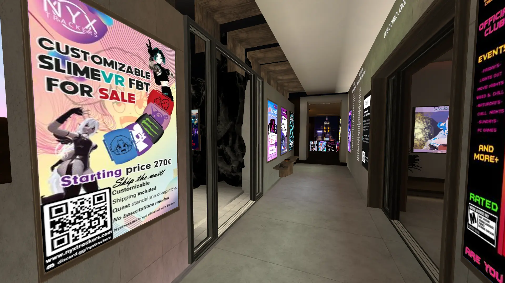
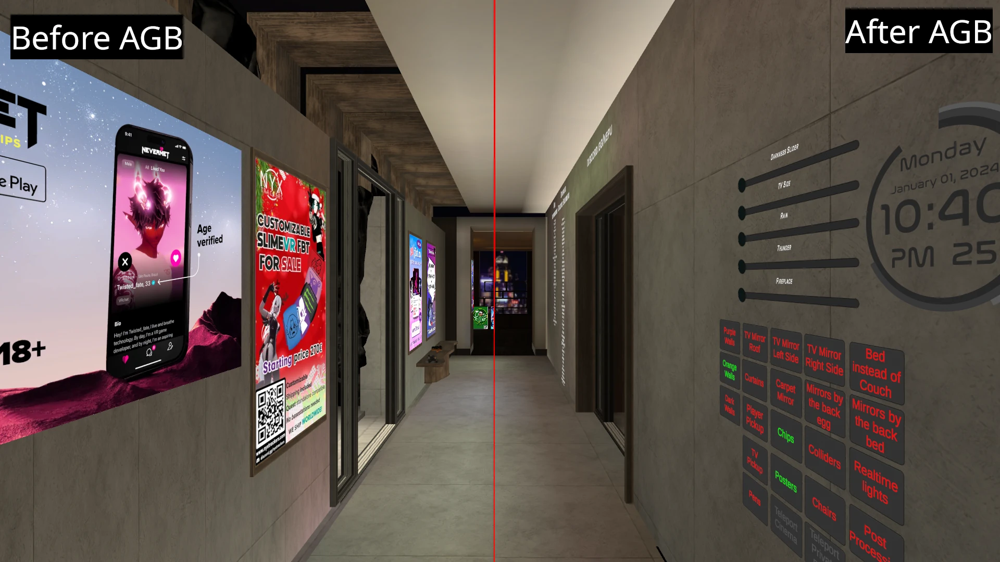
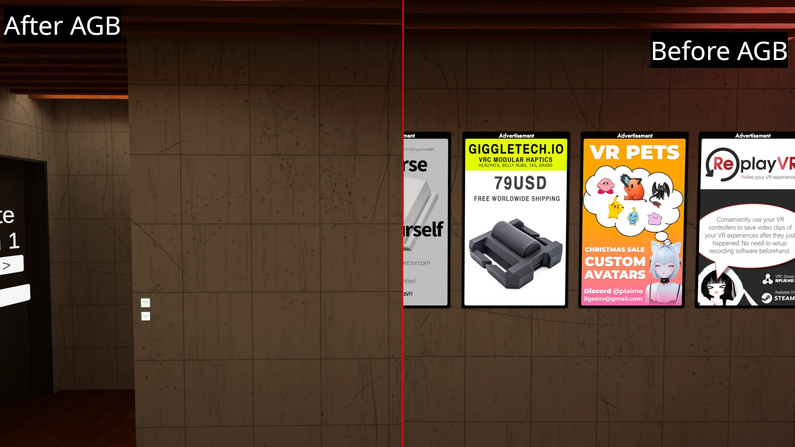
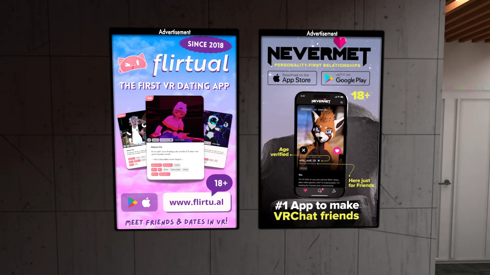

# AdGoBye - Defusing Advertisements in Virtual Reality

## Rationale

Over the years, advertisements have slowly snuck their way into worlds at a pace that we haven't ever seen
before. Creators of worlds are handed silly sums of money. This would be fine, advertisements, however, slowly reached an
excessive amount.

No offense to the creator of Movie & Chill, but almost every wall has at least one advertisement.

## Architecture

AGB works by modifying Worlds in the Cache folder, Worlds have known object names that remain static, therefore,
we can disable and modify them.

AGB has two methods for this: Blocklists and Plugins

### Blocklists

We want to give users the choice of what to hide by borrowing a mechanism similar to uBlock Origin's Filter lists.

Blocklists contain the World IDs (`wrld_*`) with the names of objects to disable, AGB then disables these objects.

We provide first-party blocklists (which are entirely opinionated by the AGB authors) [here](https://github.com/AdGoBye/AdGoBye-Blocklists), but you can load and
maintain your own blocklists. 

[Contributing](https://github.com/AdGoBye/AdGoBye/blob/main/CONTRIBUTING.md#blocklist-guidelines) contains additional
information and guidelines on how to do this.

### Plugins

Certain worlds require more work than just disabling GameObjects (texture swaps, removing String / Image loaders), which
might require specialized code. For these cases, Plugins allow users to load custom code to modify worlds.

[Contributing](https://github.com/AdGoBye/AdGoBye/blob/main/CONTRIBUTING.md#plugins) contains additional information on
how to do this.

## Ethics

AGB is developed out of love and out of fear.
Worlds are special,
they are places where you develop some of your fondest memories and push the boundaries of the technology we have today.

But over the recent months, there has been an obvious culture shift.
We've observed the ads getting more and more obtrusive.

The argument that "you should just go to a world that doesn't have ads"
is not compatible with reality; worlds get updated which might introduce ads.

There is seemingly no end to this wave of ads. In fact, their proliferation seems to imply that they're successful.
Names like Flirtual and Nevermet get away with no repercussions for preying on the socially awkward.

### World creators

If you're a world creator, and you have ads that AGB blocks,
you are likely being paid a flat rate for the ads existing in your world.

Please understand AGB is the best compromise in this system, it doesn't matter if (slightly) fewer people see the ads
because you will get paid either way.

The difference is that users like me, who are overstimulated by ads,
who don't have the expendable income to spend on the products shown,
who have no interest in the products will have a better experience in your world.

Forcing advertisements onto people who don't want them will sour their experience with the world
you have spent your hard time working on, it's not for the mutual benefit of both of us.

And if a user wants to see your world as-is, they can use the Allowlist feature provided which will skip your world
based on ID from being indexed.

### The Future
Features that skew control into the hands of users get rejected to avoid impeding creator vision. 
This is valid up to a point, however, we have reached a new era.

World creators are being handed hundreds of US dollars to feature dating app ads into their worlds,
making the creator's vision less impartial than ever before.

Never before have we had solutions like [Adlily](https://adli.ly) (fyi, website has tracking) in the limelight that
attempted to profit so explicitly off creators
by [spying on users](https://web.archive.org/web/20231120221251/https://adli.ly/analytics/retention) in complete
[disregard for the privacy of users](https://github.com/AdGoBye/AdGoBye/issues/18#issuecomment-1854959379).

While that project might be dead now, world creators are finding new ways to inflict the same damage on the users experience.

AdGoBye allows us to non-intrusively reclaim spaces tainted by this, creating more comfortable environments.